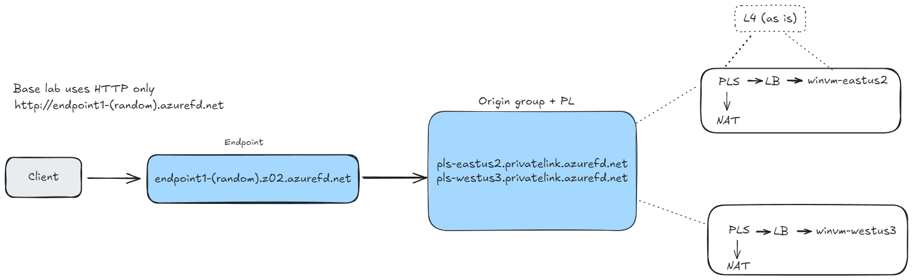

# Azure Front Door and Private Link Service Lab

This lab demonstrates how to deploy and configure Azure Front Door integrated with Azure Private Link Service (PLS). The provided `deploy.sh` script automates the deployment process, including resource creation and configuration.

## Lab Objectives

- Deploy Azure resources using Azure CLI.
- Configure Azure Front Door with Private Link Service.
- Validate connectivity through Azure Front Door to backend services.
- This lab deploy Azure Front Door with Private Link Service (PLS) accessing to Azure Windows Virtual Machines in separated regions.
- Note that this lab only works with HTTP (not HTTPS), you need to configure your DNS domain and also add commercial SSL certificate to the Windows VMs to enable HTTPS.

## Prerequisites

- Azure CLI installed (Linux) and logged in.
    - You can also use the Azure Cloud Shell available in the Azure portal.
- Appropriate Azure subscription permissions.

## Network Diagram



## Deployment Steps

1. **Login to Azure CLI**:
```bash
az login
```

2. **Set your subscription**:
```bash
az account set --subscription "<your-subscription-id>"
```

3. **Run the deployment script**:
```bash
curl -sS -O https://raw.githubusercontent.com/dmauser/azure-frontdoor-pls/refs/heads/main/deploy.sh
bash deploy.sh
```

## Validation
After deployment, verify connectivity and configuration by accessing your backend services securely through Azure Front Door.
You can leverage the script [validation.sh](https://raw.githubusercontent.com/dmauser/azure-frontdoor-pls/refs/heads/main/validations.sh) which include some validation steps.

Output example when running the loop script included in `validations.sh`:


**Special note**, check the origin health metric before running the validation script, it should be healthy as shown below:


## Cleanup

To remove all resources created by this lab, delete the resource group:
```bash
az group delete --name "<resource-group-name>" --yes --no-wait
```
